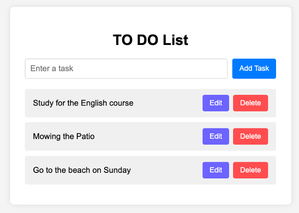

# 📝 TODO App

Una aplicación web moderna para gestionar tareas, construida con **Flask**, **Jinja2** y **Bootstrap 5**. Incluye una REST API integrada y una interfaz web responsiva para agregar, eliminar y ver tus tareas fácilmente.



---

## 🚀 Tecnologías utilizadas

- [Flask](https://flask.palletsprojects.com/) – Backend y servidor web
- [Jinja2](https://jinja.palletsprojects.com/) – Motor de plantillas HTML
- [Bootstrap 5](https://getbootstrap.com/) – Framework CSS para diseño moderno y responsivo
- HTML5, CSS3, JavaScript (mínimo)

---

## 📁 Estructura del Proyecto

```plaintext
todo_app/
│
├── static/
│   └── css/
│       └── styles.css         # Estilos personalizados
│
├── templates/
│   ├── base.html              # Layout principal
│   └── index.html             # Página principal con formulario
│
├── app.py                     # App principal con vistas y lógica de frontend
├── api.py                     # (Opcional) Servicio REST separado
└── requirements.txt           # Dependencias del proyecto
```

## ✨ Características

✅ Interfaz limpia y responsiva con Bootstrap 5
✅ Agregar nuevas tareas
✅ Eliminar tareas existentes
✅ API REST integrada (/todos)
✅ Código modular y mantenible

## 🔧 Instalación del App

### Clona el repositorio:

```plaintext
git clone https://github.com/tu-usuario/todo-app.git
cd todo-app
```

### Instala las dependencias:

```plaintext
pip install -r requirements.txt
```

### Ejecuta la aplicación:

```plaintext
python app.py
```

Abre tu navegador y ve a http://localhost:5000

## 📡 Endpoints de la API

### GET /todos

Retorna la lista de tareas en formato JSON.

### POST /todos

Agrega una nueva tarea. Cuerpo esperado:

```plaintext
{ "todo": "Nueva tarea" }
```

### DELETE /todos

Elimina una tarea. Cuerpo esperado:

```plaintext
{ "todo": "Tarea a eliminar" }
```

### PUT /todos

Actualiza una tarea. Cuerpo esperado:

```plaintext
{ "old": "Tarea anterior", "new": "Tarea nueva" }
```
